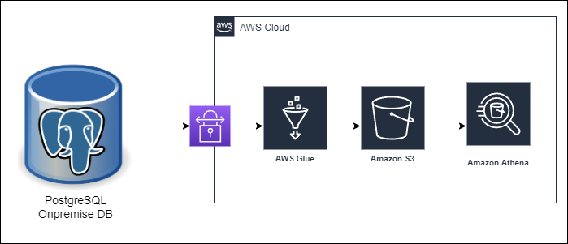

# Jobsity DataChallenge
## Requirements
This project is developed for the Jobsity Data Engineering challenge:

For this challenge the user must follow the upcoming requirements:
- The project is developed on a local computer with windows 11 OS and an Ubuntu 20.04 subsystem.
- Install python3 using the the versions 3.8 to 3.10
    - The python libraries required are: os, pandas, pandasql, numpy, datetime, matplotlib.pyplot, tqdm, and psycopg2

- Install the PostgreSQL database with the versions 12 to 14  on the local computer:
    - To start using the database execute the following command: sudo service postgresql start
    - On the PostgreSQL DB Create the database named "challenge".
    - On PostgreSQL crate a user named "challenge", and grant the all the permissions on the db "challenge" to the User: "challenge".
    - The password for the user challenge must be Jobsity.
    - Edit the pg_hba.conf file changing the line of the Database administrative login by Unix domain socket to the following:
      local     all      all                 md5
      This allows connection on the local database to all the users.

- To execute the project:
    - First on the terminal change the directory where the repository is cloned.
    - Open a terminal or console application and write and execute the following command: python3 challengeETL.py 

## Project summary   
In this case we'll be using a PostgreSQL database. We'll be developing a python ETL, that wil read the csv with the sample dataset. Then we'll generate the dataframes for the fact table and each
dimension table, as this challenge was developed using a Star Schema for the data model.

Afterwards, using the dimension tables and the fact table we'll be solving the requirements listed in the guidelines. The results will be displayed as plots were the user can see the number of 
trips made weekly. Also the project informs the user of the status of the processes on the console.

Finally, the tables (fact tables, dimension tables, and result table) are written to the PSQL DB.

### Implementing the data model for scalability
- For this challenge the data model solution implemented is a Star Schema. We create a fact table named trips_ft, this table has the region id, the origin and destination coordinates, the date and the id of the data source. the id fields helps to join the table to the dimmensions tables where we can found the regions and the datasources.
In this schema in the center we'll have our trips fact table, which have a table_id field which is a unique id for every field of the table, the region_id (region unique identifier), origin_coord,
destination_coord, datetime, and the datasource_id (datasource unique identifier)
We'll generate two dimension tables: dim_region (in which we store the regions of each made trips and the trip_id which is a Unique id to identify the region that also helps
to join this dimension to the fact table), and the dim_datasource (table that stores the datasource name and the datasource_id to identify the field and helps to join this dimension table to the 
fact table)

### Developing the solution on the cloud
- We can use a solution in AWS by using as our storage system AWS S3. Where we can create a bucket, in which we'll save the date in parquet format. As S3 doesn't require of a computing infrastructure underneath to support the data processing, the data saving and reading will be faster that using a SQL data base on the cloud. As our processing environment we will use AWS GLue, where we can deploy our ETL processes by using pyspark, sparksql, and/or python. Finally, if we want to query and visualize our data stored in S3 we can use AWS Athena to perform serverlsess SQL queries. If the stored data is required for posterior analysis, or developing, we can use AWS Sagemaker to perform analysis in any language supported by the platform, also the data can be easily accesed using s3 endpoints with the required IAM permissions.

Below an schema of a possible infrastructure solution using AWS is displayed. 
If the data is stored in any SQL o NoSQL DB on premise, first we will need to stablish connection to the database through a Site-to-site VPN. Then by using AWS Glue we'll perform the required ETL 
processes, and finally store our data in S3.

